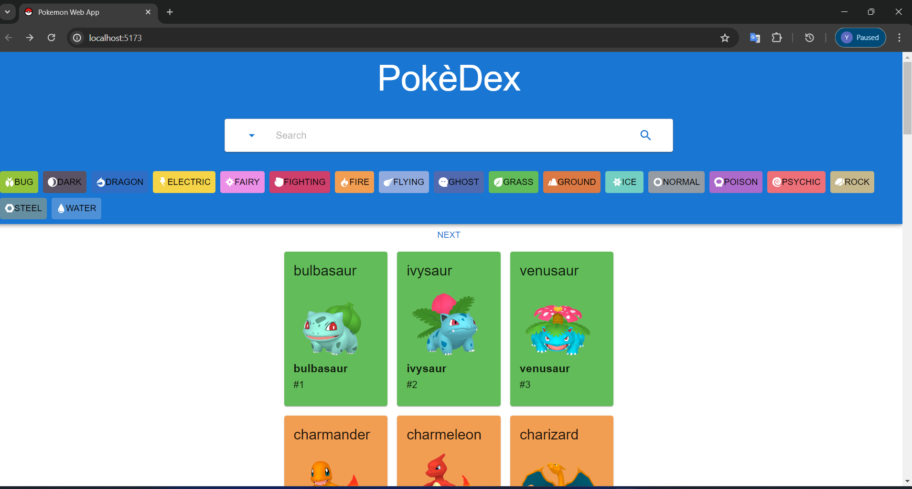
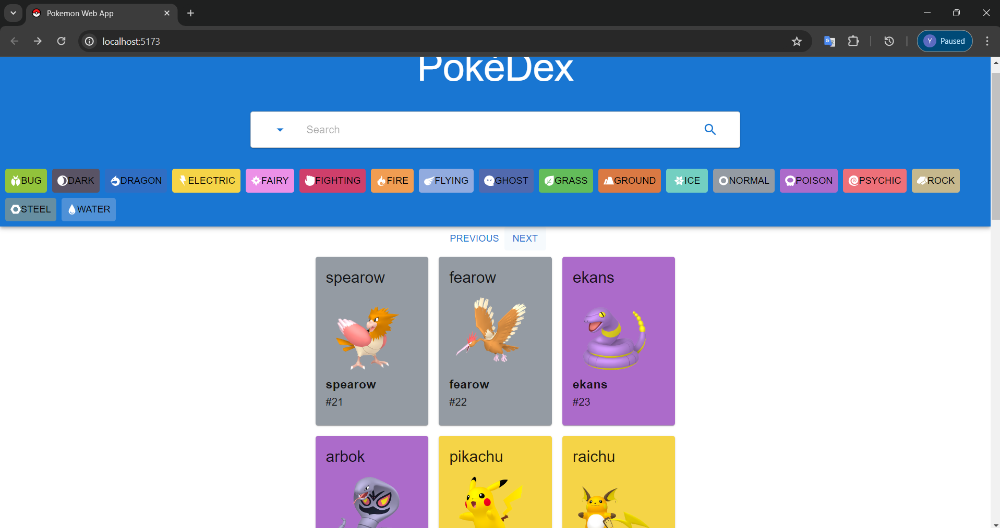

# Pokédex React App
Pokédex React app that lets you discover and explore Pokémon based on [PokéAPI](https://pokeapi.co/).

Explore and get information about each Pokémon, including their about, stats, and evolution.
This project built with React.js and Material UI.

## Preview

| <!--                                --> | <!--                                --> | <!--                                --> |
|-----------------------------------------|-----------------------------------------|-----------------------------------------|
|  |  |  |
|  |  |

## Features
- Browse Pokémons based on their types (This component not complete)
-Search Pokémons based on their name or Id Number (This component not complete)
- Clicking on a Pokémon opens a modal with detailed information
  - About tab: Displays information about the selected Pokémon
  - Stats tab: Shows the statistical attributes and characteristics of the Pokémon
  - Evolution tab: Visualizes the evolutionary chain of the Pokémon 